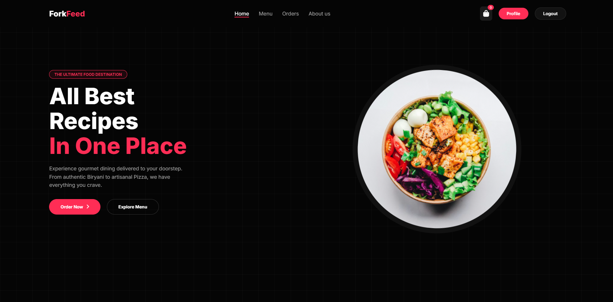
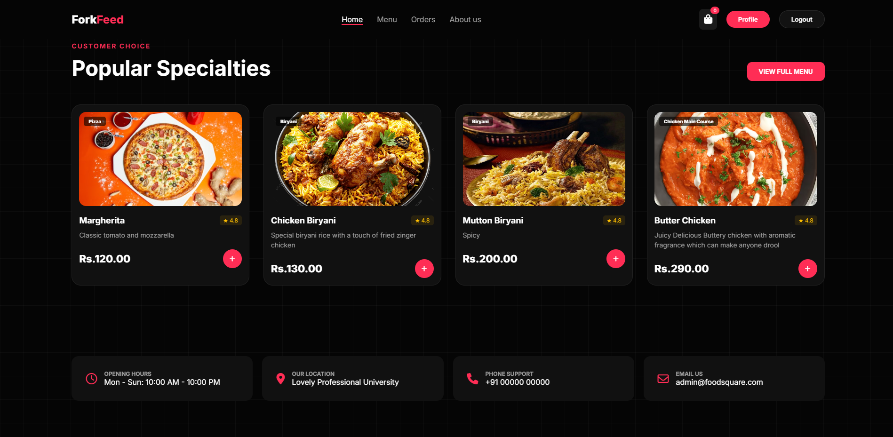
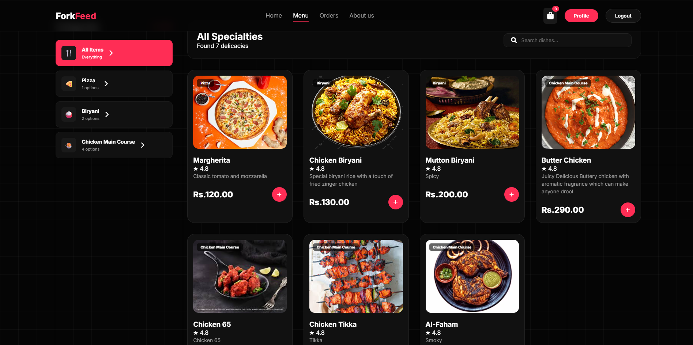
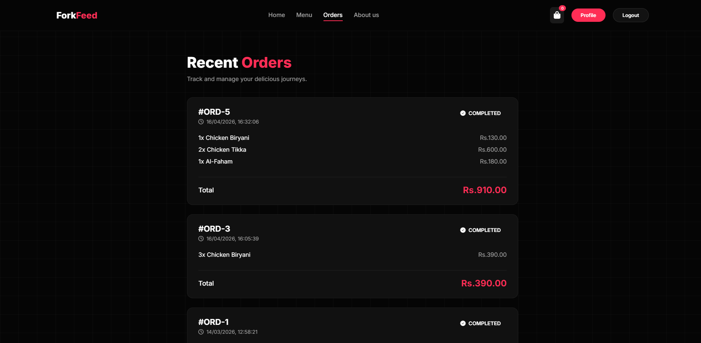
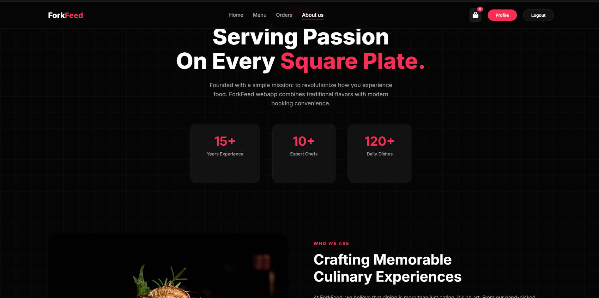
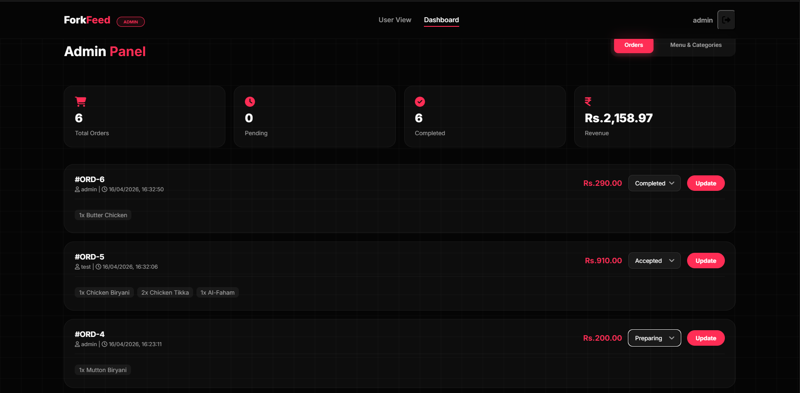
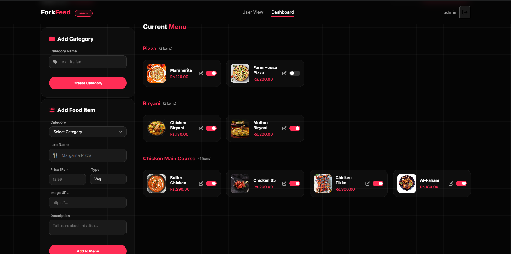

# 🍽️ ForkFeed — The Ultimate Food Ordering Platform

ForkFeed is a premium, real-time food ordering and management system designed for a seamless gourmet experience. Built with a powerful Flask backend and a modern, high-performance vanilla JS frontend, ForkFeed offers a sleek dark-themed interface with vibrant accents and glassmorphism design elements.



## 🌟 Key Features

### 👤 Customer Experience
- **Elegant UI**: Modern dark-mode aesthetic with smooth animations and responsive layouts.
- **Dynamic Menu**: Real-time menu updates with category filtering and smart search.
- **Persistent Cart**: Isolated tab sessions using `sessionStorage` for independent multi-account testing.
- **Order Tracking**: Detailed order history with live status updates (Pending, Accepted, Preparing, Ready, Completed).
- **Secure Authentication**: JWT-based authentication with automatic session management.

### 🛠️ Admin Dashboard
- **Live Order Management**: Real-time status updates for incoming orders with instant UI synchronization.
- **Menu & Category Control**: Easy-to-use forms for adding/editing food items and categories.
- **Availability Toggles**: Instantly hide/show items or entire categories from the customer menu.
- **Revenue Analytics**: Visual stats for total orders, pending tasks, and global revenue.

## 📸 Screenshots

### Customer View
| Home Page | Menu Page |
|-----------|-----------|
|  |  |

| User Orders | About Us |
|-----------|-----------|
|  |  |

### Admin Dashboard
| Orders Management | Menu Control |
|-----------|-----------|
|  |  |

## 🚀 Technology Stack

- **Backend**: Flask (Python) with SQLAlchemy (SQLite)
- **Frontend**: Vanilla JavaScript (ES6+ Modules), HTML5, CSS3
- **Security**: Flask-JWT-Extended for token-based authentication, Bcrypt for password hashing
- **Styling**: Modern CSS with CSS Variables, Flexbox, and CSS Grid

## 📦 Getting Started

### Prerequisites
- Python 3.8+
- pip (Python package manager)

### Installation

1. **Clone the repository**:
   ```bash
   git clone https://github.com/KevinVinu/Fork-Feed.git
   cd Fork-Feed
   ```

2. **Install dependencies**:
   ```bash
   pip install -r backend/requirements.txt
   ```

3. **Run the application**:
   ```bash
   python backend/app.py
   ```

4. **Access the platform**:
   - Open your browser and go to `http://localhost:8080`
   - **Admin Account**: refer to the code
   - **User Account**: Create a new account via the Signup page.

## 🛡️ Security Features
- **Session Isolation**: Utilizes `sessionStorage` for cross-account testing in separate tabs.
- **JWT Protection**: All sensitive API endpoints are protected by JSON Web Tokens.
- **CORS Enabled**: Configured for secure resource sharing.

---
Built with ❤️ by [Kevin Vinu](https://github.com/KevinVinu)
